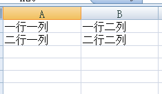
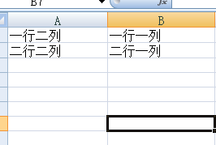

# JsonExportExcel

> [json导出excel](https://cuikangjie.github.io/JsonExportExcel/) 支持中文

> [EXAMPLE](example/index.html)

> 记得点star

> by kin

#### 安装方法
```shell
 # clone项目
 git clone  https://github.com/cuikangjie/JsonExportExcel.git
 # 下载依赖
 npm install
 # build dist
 npm run build

```

#### 使用方法

1.引入js

```html
<script src="dist/JsonExportExcel.min.js"></script>
```

2.js代码

```javascript  
var option={};   

option.data=[{a:1,b:2},{a:2,b:3}];   

var toExcel=new ExportJsonExcel(option);   

toExcel.saveExcel();
```

option

* data 数据源

```javascript
<!--两种形式-->
<!--第一种 object-->
[{one:'一行一列',two:'一行二列'},{one:'二行一列',two:'二行二列'}]
<!--第二种 arrary-->
[['一行一列','一行二列'],['二行一列','二行二列']]
```
效果




* filter 列过滤(只有在data为object下起作用)

```javascript
option.filter=['two','one'];

```
效果：





* fileName 下载文件名(默认：download)
